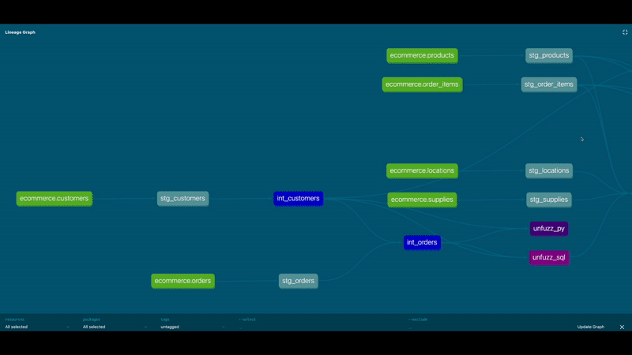

# dbt Python models on Snowpark demo for Coalesce 2022

This repository contains a demo of dbt Python models Snowflake via Snowpark for the Coalesce 2022 conference.

## Cool gif

Python, node colors, metrics -- in a gif!

## Cool DAG

## Setup

WIP.

### Source data

TBD. See main branch.

### Local Python environments

I personally use two separate Python `venv`s: one named `rc` with the v1.3rc installed for running `dbt` commands and another named `snowy` with Snowpark Python packages + data science stuff installed for running in a local notebook. The former is 3.10 and the latter is 3.8, required for the Snowpark package.

You could use a single `venv`. Note the installs for `snowy` and instructions on setup are in `models/challenges/py/Untitled.ipynb`, along with local prototypes for all challenge solutions.

## Challenges

See [the challenges directory's README.md](models/challenges/README.md).
