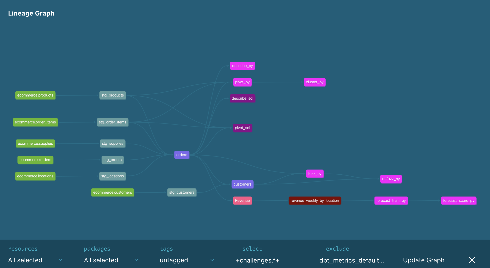

# `dbt-sql` vs `dbt-py` challenges!

We believe using SQL and Python together in a dbt project -- using the best tool for the job -- is the way to go. To do that, you need to understand when either language is better. There will be some subjectivity within the middle. Keep in mind the performance hit with Python models, which is expected to improve over time as the data platforms do but likely not reach that of SQL models.

This directory is split into `sql/` and `py/` subdirectories with the models for each challenges. We can't reuse the same model names, so `_sql` and `_py` are postfixed on the model names respectively. The main reason for still separating into subdirectories is easier configuration in `dbt_project.yml` for node colors.

This generates the following DAG for sources, models, and metrics used in the challenges:

TODO: update screenshot after finalizing `fuzz_sql` model.

## Challenges

The challenges are listed below. Local prototypes for solutions in a Python notebook (+the visualizations for the ML stuff) can be found in [py/Untitled.ipynb](py/Untitled.ipynb).

### describe: describe orders

Our data science team requests we calculate some useful statistics about the data to test and alert if it goes outside a certain range.

For each column orders, get the:

- min
- mean
- max
- stddev
- count

Solutions:

- [py/describe_py.py](py/describe_py.py)
- [sql/describe_sql.sql](sql/describe_sql.sql)

### pivot: add the subtotals for each product_id to orders

Our data science team needs the subtotals per order by product_id. In Python, this is achieved by pivoting the data. They've already sent you their pandas code so you simply copy it into a model. For SQL, the solution is more lines of code but (arguably) far more elegant.

Solutions:

- [py/pivot_py.py](py/pivot_py.py)
- [sql/pivot_sql.sql](sql/pivot_sql.sql)

### unfuzz: flag potential duplicates in customers

Our employees manually enter customer names. Sometimes they make typos. Sometimes customers give slightly different names, for instance "Jeremy" one time and "jerco" another. We want to flag potential duplicates for further scrutiny.

Solutions:

- [py/fuzz_py.py](py/fuzz_py.py) and [py/unfuzz_py.py](py/unfuzz_py.py)
- [sql/unfuzz_sql.sql](sql/unfuzz_sql.sql)

The first Python model fuzzes up the customer names from orders and the second unfuzzes them using the known customers. The SQL model uses the first Python model and does the same thing as the second.

**Important**: the `unfuzz_py` model is very slow and excluded from the [default selector](../../selectors.yml).

### cluster: segment customers into potentially useful groups given their order history

You are the data scientist now! Using the data from the earlier pivot challenge (orders with subtotals), cluster orders into a suspected number of natural groups -- personas or order profiles -- for further use in marketing, sales, and data science.

Solutions:

- [py/cluster_py.py](py/cluster_py.py)

**Important**: this is just clustering the orders with subtotals and adding the labels, not classifying customers. You could do that by just adding their most common order label to the customers table. TODO: check against actual personas in the simulated data for correlation.

### forecast: predict revenue by location

Predict revenue three years into the future by location_id using the Revenue metric. 

Solutions:

- [py/forecast_train_py.py](py/forecast_train_py.py) and [py/forecast_score_py.py](py/forecast_score_py.py)

The first model trains a ML model per location_id and stores it in a table and the second loads the ML models back in and stores its predictions into the future. See [Untitled.ipynb](Untitled.ipynb) for visualization.
